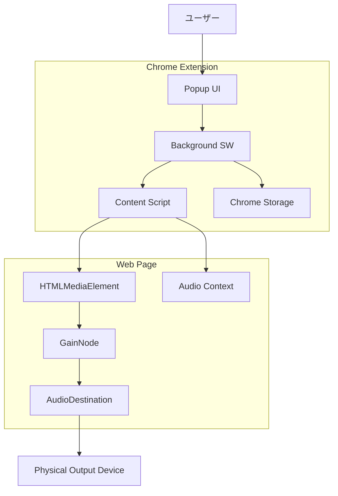

# 基本設計書 (Basic Design)

## 1. システムアーキテクチャ概要
### 1.1 全体構成図 (Mermaid)
本システムは WXT Framework を用いて構築され、以下のコンポーネントで構成される。



### 1.2 主要コンポーネントの役割
*   **Popup UI (Svelte)**
    *   現在開かれているタブ（特に音声再生中のタブ）の一覧を表示する。
    *   各タブに対する「出力デバイス選択」と「音量スライダー」を提供する。
    *   ユーザーの操作をメッセージとしてBackgroundへ送信する。
*   **Background Service Worker**
    *   拡張機能のバックエンドとして動作。
    *   PopupとContent Script間のメッセージングを中継する（Popupは直接Content Scriptと通信できない場合があるため）。
    *   タブのライフサイクル（生成、更新、閉鎖）を監視し、設定の自動適用（永続化データの復元）をトリガーする。
*   **Content Script**
    *   各Webページ（タブ）内で実行される。
    *   ページ内の `<audio>` および `<video>` 要素を `MutationObserver` で監視・検出する。
    *   **オーディオ出力制御**: `HTMLMediaElement.setSinkId()` を呼び出して出力先を変更する。
    *   **音量制御**: `AudioContext` を生成し、メディア要素をソースとして `GainNode` を経由させることで、音量調整（および将来的な増幅・EQ）を実現する。

## 2. データフロー設計
### 2.1 音声制御フロー
1.  **検知**: Content Scriptがページ読み込み時およびDOM変更時にメディア要素を検出する。
2.  **操作**: ユーザーがPopupで「出力先: ヘッドフォン」を選択する。
3.  **送信**: Popup -> Background -> 特定のタブのContent Script へ `SET_DEVICE` メッセージが飛ぶ。
4.  **適用**: Content Scriptが対象のメディア要素に対し `element.setSinkId(deviceId)` を実行する。

### 2.2 設定保存と復元フロー
1.  **保存**: ユーザーが設定を変更した際、Backgroundスクリプトが `chrome.storage.local` に「URL（またはドメイン）」をキーとして設定を保存する。
2.  **復元**:
    *   ユーザーが再度同じURLのページを開く。
    *   Content Scriptが読み込まれる。
    *   Backgroundに「保存された設定はあるか？」と問い合わせる（またはBackgroundが `tabs.onUpdated` でプッシュする）。
    *   設定があれば、初期化時に即座にデバイスと音量を適用する。

## 3. データモデル設計 (Data Persistence)
### 3.1 ストレージ設計 (`chrome.storage.local`)
設定は「URL（オリジン）」をキーとして保存し、次回訪問時に復元可能とする。

```typescript
// ストレージ全体の型定義
interface StorageSchema {
  // キー: ページのURL（またはオリジン）
  // 値: そのページでのオーディオ設定
  audioSettings: {
    [url: string]: PageAudioSetting;
  };
}

interface PageAudioSetting {
  deviceId?: string;  // 選択された出力デバイスID
  volume?: number;    // 音量 (0.0 - 1.0, 将来的には >1.0 も許容)
  muted?: boolean;    // ミュート状態
  lastUpdated: number; // 最終更新タイムスタンプ (古い設定の掃除用)
}
```

## 4. インターフェース設計方針
### 4.1 メッセージパッシング (Message Protocol)
Type-safeなメッセージングを行うため、以下のメッセージ型を定義する。

*   **`GET_TABS_INFO`**: Popup -> Background (アクティブなタブ情報の要求)
*   **`GET_DEVICES`**: Popup -> Background (またはContent Script) (利用可能なデバイス一覧の要求)
*   **`SET_DEVICE`**: Popup -> Background -> Content Script (デバイス変更指示)
    *   Payload: `{ tabId: number, deviceId: string }`
*   **`SET_VOLUME`**: Popup -> Background -> Content Script (音量変更指示)
    *   Payload: `{ tabId: number, volume: number }`

## 5. セキュリティ・権限設計
### 5.1 必要な権限 (Manifest V3)
*   `tabs`: タブのタイトルやURLを取得し、Popupに一覧表示するため。
*   `storage`: 設定の永続化のため。
*   `scripting`: 任意のページにContent Scriptを注入・制御するため。
*   `activeTab`: 現在のタブに対する操作権限を確実に得るため。

### 5.2 技術的制約への対処
*   **CORS制限**: `MediaElementSource` を使用して `AudioContext` に接続する場合、Cross-Originのメディアリソース（CDN上の動画など）でCORSエラーが発生する可能性がある。
    *   *対策*: `crossOrigin="anonymous"` 属性の付与を試みる、あるいは音量制御に関しては `HTMLMediaElement.volume`（標準プロパティ）で代替可能か検討する。
    *   *基本方針*: まずは標準プロパティ(`volume`)と `setSinkId` での実装を優先し、機能不足（増幅が必要など）の場合のみ Web Audio API を適用する段階的アプローチをとる。

