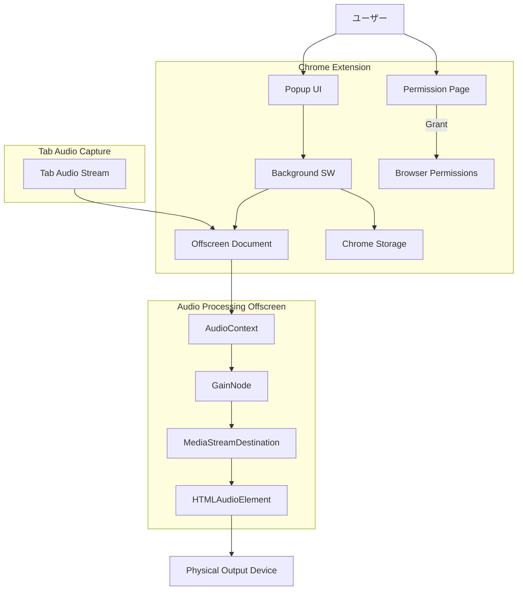

# 基本設計書 (Basic Design)

## 1. システムアーキテクチャ概要
### 1.1 全体構成図 (Mermaid)
本システムは WXT Framework を用いて構築され、以下のコンポーネントで構成される。



### 1.2 主要コンポーネントの役割
*   **Popup UI (Svelte)**
    *   現在開かれているタブ（特に音声再生中のタブ）の一覧を表示する。
    *   各タブに対する「出力デバイス選択」と「音量スライダー」を提供する。
    *   デバイス権限がない場合、権限取得ページ (`permissions.html`) を開く導線を提供する。
*   **Background Service Worker**
    *   拡張機能のバックエンドとして動作。
    *   Popup からの要求を受け、`chrome.tabCapture.getMediaStreamId` でストリームIDを取得する。
    *   `Offscreen Document` のライフサイクルを管理し、ストリームIDを渡してキャプチャを開始させる。
*   **Offscreen Document (`offscreen.html` / `utils/offscreen-handler.ts`)**
    *   Background から受け取ったストリームIDを使用して `getUserMedia` を実行し、タブの音声をキャプチャする。
    *   **Web Audio API** を使用して音量調整 (`GainNode`) を行う。
    *   **オーディオ出力制御**: 生成した `HTMLAudioElement` に対して `setSinkId()` を呼び出し、物理デバイスへの出力を行う。
*   **Permission Page (`permissions.html`)**
    *   ユーザーにマイク権限（デバイス列挙のため）を要求するための一時的なページ。
    *   Popup 内では権限要求が不安定なため、別タブとしてこれを開く。

## 2. データフロー設計
### 2.1 音声制御フロー
1.  **操作**: ユーザーがPopupで音量変更やデバイス変更を行う。
2.  **送信**: Popup -> Background へ `SET_VOLUME` や `SET_DEVICE` メッセージが飛ぶ。
    *   初回のみ `START_CAPTURE` が送信され、Background がキャプチャを開始する。
3.  **中継**: Background -> Offscreen Document へメッセージとストリームIDが転送される。
4.  **処理**: Offscreen Document 内の `AudioContext` が音声を処理し、`HTMLAudioElement` が指定デバイスへ出力する。

### 2.2 設定保存と復元フロー
1.  **保存**: ユーザーが設定を変更した際、Popup が `chrome.storage.local` に「URL（またはドメイン）」をキーとして設定を保存する。
2.  **復元**:
    *   ユーザーが再度同じURLのページを開き、Popup を開く。
    *   Popup 初期化時に保存された設定を読み込む。
    *   設定が存在する場合、自動的にキャプチャを開始し、設定値を適用する。

## 3. データモデル設計 (Data Persistence)
### 3.1 ストレージ設計 (`chrome.storage.local`)
設定は「URL（オリジン）」をキーとして保存し、次回訪問時に復元可能とする。

```typescript
// ストレージ全体の型定義
interface StorageSchema {
  // キー: ページのURL（またはオリジン）
  // 値: そのページでのオーディオ設定
  audioSettings: {
    [url: string]: PageAudioSetting;
  };
}

interface PageAudioSetting {
  deviceId?: string;  // 選択された出力デバイスID
  volume?: number;    // 音量 (0.0 - 1.0)
  muted?: boolean;    // ミュート状態
  lastUpdated: number; // 最終更新タイムスタンプ
}
```

## 4. インターフェース設計方針
### 4.1 メッセージパッシング (Message Protocol)
Type-safeなメッセージングを行うため、以下のメッセージ型を定義する。

*   **`START_CAPTURE`**: Popup -> Background -> Offscreen
    *   Payload: `{ tabId: number, streamId: string }` (Background -> Offscreen時)
*   **`SET_DEVICE`**: Popup -> Background -> Offscreen
    *   Payload: `{ tabId: number, deviceId: string }`
*   **`SET_VOLUME`**: Popup -> Background -> Offscreen
    *   Payload: `{ tabId: number, volume: number, muted: boolean }`

## 5. セキュリティ・権限設計
### 5.1 必要な権限 (Manifest V3)
*   `tabs`, `activeTab`: タブ情報の取得。
*   `storage`: 設定の永続化。
*   `tabCapture`: タブの音声をキャプチャするため。
*   `offscreen`: バックグラウンドで音声を処理するため（Service Workerでは不可）。

### 5.2 権限取得フロー
*   `navigator.mediaDevices.enumerateDevices` でデバイス名を取得するには、サイト（拡張機能）へのマイク権限許可が必要。
*   Popup で「Grant Permission」を押すと、`permissions.html` が新規タブで開く。
*   ユーザーが許可すると、そのオリジン（拡張機能全体）に対して権限が付与され、以降はPopupでもデバイス名が表示される。
