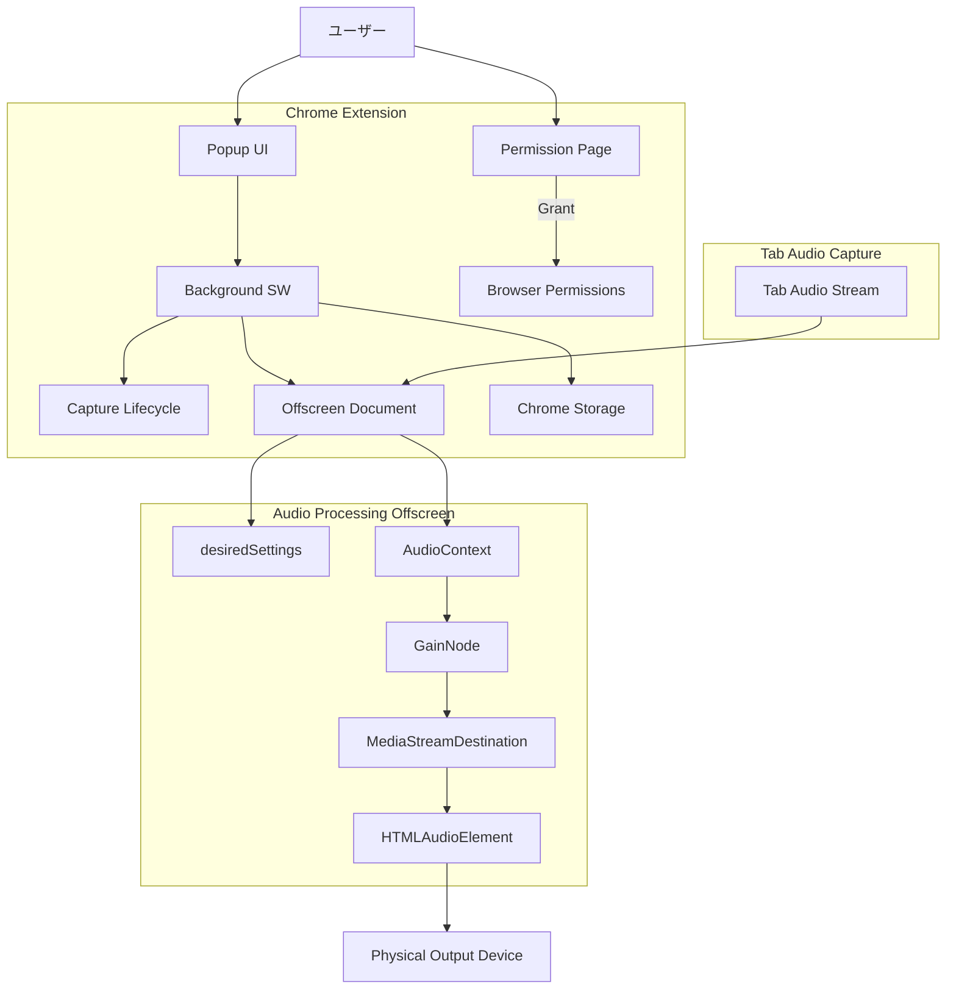

# 基本設計書 (Basic Design)

## 1. システムアーキテクチャ概要
### 1.1 全体構成図 (Mermaid)
本システムは WXT Framework を用いて構築され、以下のコンポーネントで構成される。



### 1.2 主要コンポーネントの役割
*   **Popup UI (Svelte)**
    *   現在アクティブなタブの情報を表示する。
    *   「出力デバイス選択」と「音量スライダー」を提供する。
    *   保存済みの非デフォルト設定がある場合、開いた時点でキャプチャ復元を試みる。
    *   デバイス権限がない場合、権限取得ページ (`permissions.html`) を開く導線を提供する。
*   **Background Service Worker**
    *   拡張機能のバックエンドとして動作。
    *   Popup からの `START_CAPTURE` を受け、`chrome.tabCapture.getMediaStreamId` と保存設定読み込みを行い Offscreen へ渡す。
    *   `Offscreen Document` のライフサイクルを管理する（`USER_MEDIA` reason。消失時は 1 回リトライ）。
    *   ブラウザ起動時 / タブ更新時に、復元が必要なタブへツールバーバッジ（`!`）を表示する。
*   **Capture Lifecycle / Capture Settings**
    *   キャプチャ開始の重複防止、保存設定の適用、要操作インジケータの更新を担う。
    *   Chrome 側の stale `pending` をポーリングし、固着時は `needs_action` へ落とす。
*   **Offscreen Document (`offscreen.html` / `utils/offscreen-handler.ts`)**
    *   Background から受け取ったストリームIDを使用して `getUserMedia` を実行し、タブの音声をキャプチャする。
    *   **Web Audio API** を使用して音量調整 (`GainNode`) を行う。
    *   **オーディオ出力制御**: 生成した `HTMLAudioElement` に対して `setSinkId()` を呼び出し、物理デバイスへの出力を行う。
    *   キャプチャ再構築時も `desiredSettings` により設定を保持する。
*   **Permission Page (`permissions.html`)**
    *   ユーザーにマイク権限（デバイス列挙のため）を要求するための一時的なページ。
    *   Popup 内では権限要求が不安定なため、別タブとしてこれを開く。

## 2. データフロー設計
### 2.1 音声制御フロー
1.  **操作**: ユーザーがPopupで音量変更やデバイス変更を行う。
2.  **キャプチャ開始**: 未キャプチャなら Popup -> Background へ `START_CAPTURE`（`streamId` なし）を送信する。
3.  **中継**: Background が streamId と保存設定を付与し、Offscreen Document へ転送する。
    *   Offscreen が消失している場合は再作成して 1 回再送する。
4.  **適用**: キャプチャ成功後、Popup が `SET_DEVICE` / `SET_VOLUME` を送信し、各操作は `CaptureResult` を返す。
5.  **保存**: `SET_DEVICE` / `SET_VOLUME` まで成功したときだけ `chrome.storage.local` に保存する。
6.  **処理**: Offscreen Document 内の `AudioContext` が音声を処理し、`HTMLAudioElement` が指定デバイスへ出力する。

### 2.2 設定保存と復元フロー
1.  **保存**: キャプチャと設定適用が成功したときのみ、Popup がオリジン単位で設定を保存する（失敗時は storage を更新しない）。
2.  **Popup からの復元**:
    *   ユーザーが再度同じオリジンのページを開き、Popup を開く。
    *   非デフォルト設定が存在する場合、自動的にキャプチャを開始し、設定値を適用する。
3.  **ブラウザ再起動後の案内**:
    *   Chrome 再起動後、Service Worker は自動ではキャプチャを再開できない（ユーザー操作が必要）。
    *   代わりに、非デフォルト設定が保存されているタブのアクションバッジに `!` を表示し、Popup 操作での復元を促す。
4.  **stale pending の扱い**:
    *   `tabCapture` が `pending` のまま固着した場合は短時間待機後に `needs_action` とし、再操作を促す。
5.  **キャプチャ再構築時の保持**:
    *   ストリーム再取得などでセッションが作り直されても、Offscreen 側の `desiredSettings` によりデバイス / 音量を維持する。

## 3. データモデル設計 (Data Persistence)
### 3.1 ストレージ設計 (`chrome.storage.local`)
設定は「オリジン」をキーとして保存し、次回訪問時に復元可能とする。

```typescript
interface PageAudioSetting {
  deviceId: string | null; // 選択された出力デバイスID
  volume: number;          // 音量 (0.0 - 1.0)
  muted: boolean;          // ミュート状態
  timestamp: number;       // 最終更新タイムスタンプ
}

// キー形式: `audio_settings:${origin}`
interface StorageSchema {
  [key: string]: PageAudioSetting;
}
```

## 4. インターフェース設計方針
### 4.1 メッセージパッシング (Message Protocol)
Type-safeなメッセージングを行うため、以下のメッセージ型を定義する。

*   **`START_CAPTURE`**: Popup -> Background -> Offscreen
    *   Popup -> Background: `{ tabId }`（`streamId` なし）
    *   Background -> Offscreen: `{ tabId, streamId, settings? }`
*   **`SET_DEVICE`**: Popup -> Offscreen（Background 経由のブロードキャスト可）
    *   Payload: `{ tabId: number, deviceId: string }`
    *   応答: `CaptureResult`
*   **`SET_VOLUME`**: Popup -> Offscreen
    *   Payload: `{ tabId: number, volume: number, muted: boolean }`
    *   応答: `CaptureResult`
*   **`CAPTURE_STATUS`**: Offscreen / tabCapture イベント -> Background / Popup
    *   Payload: `{ tabId: number, status: 'active' | 'pending' | 'needs_action' | 'error', error? }`

## 5. セキュリティ・権限設計
### 5.1 必要な権限 (Manifest V3)
*   `tabs`, `activeTab`: タブ情報の取得。
*   `storage`: 設定の永続化。
*   `tabCapture`: タブの音声をキャプチャするため。
*   `offscreen`: バックグラウンドで音声を処理するため（Service Workerでは不可）。

### 5.2 権限取得フロー
*   `navigator.mediaDevices.enumerateDevices` でデバイス名を取得するには、サイト（拡張機能）へのマイク権限許可が必要。
*   Popup で「Grant Permission」を押すと、`permissions.html` が新規タブで開く。
*   ユーザーが許可すると、そのオリジン（拡張機能全体）に対して権限が付与され、以降はPopupでもデバイス名が表示される。
