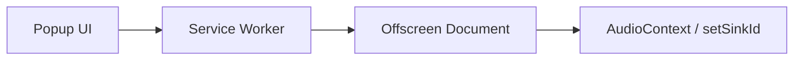

# 開発・デバッグ・公開ガイド (Development Guide)

本ドキュメントは、Tab Audio Selector のローカル開発、デバッグ、Chrome ウェブストアへの提出手順をまとめたものです。

関連資料:

- ストア掲載文: [store_description.md](./store_description.md)
- プライバシー説明: [privacy_practices.md](./privacy_practices.md)
- 技術設計: [technical_design.md](./technical_design.md)

---

## 1. 前提環境

| 項目 | 推奨 |
|------|------|
| OS | Windows / macOS / Linux（WSL2 可） |
| ランタイム | Node.js 20 LTS 以上 |
| パッケージマネージャ | pnpm |
| ブラウザ | Google Chrome（Manifest V3 対応） |
| フレームワーク | WXT + Svelte 5 + TypeScript |

このリポジトリでは [mise](https://mise.jdx.dev/) で Node / pnpm を揃える想定です。mise を使う場合:

```bash
mise install
eval "$(mise activate zsh)"   # または bash
```

---

## 2. 開発コードの実行方法

### 2.1 依存関係のインストール

```bash
pnpm install
```

初回は `postinstall` で `wxt prepare` が走り、型定義などが生成されます。

### 2.2 開発モード（HMR あり）

```bash
pnpm dev
```

- WXT が拡張機能をビルドし、出力先（通常 `.output/chrome-mv3`）を更新します。
- ソース変更時はホットリロード相当の更新が行われます。
- 初回、または大きな変更後は Chrome 側で拡張機能の再読み込みが必要になることがあります。

### 2.3 本番相当ビルド（手動検証用）

```bash
pnpm build
```

- `BUILD_TARGET=manual` が付与され、拡張機能名に `(manual)` が付きます。
- 出力先: `.output/chrome-mv3/`
- ローカルで「パッケージ化されていない拡張機能」として読み込む用途向けです。

### 2.4 Chrome への導入（Load unpacked）

1. Chrome で `chrome://extensions` を開く。
2. 右上の **デベロッパーモード** をオンにする。
3. **パッケージ化されていない拡張機能を読み込む** をクリックする。
4. 次のいずれかを選択する。
   - 開発中: `pnpm dev` 実行中に表示される出力ディレクトリ（通常 `.output/chrome-mv3`）
   - ビルド後確認: `pnpm build` 後の `.output/chrome-mv3`
5. ツールバーに Tab Audio Selector のアイコンが表示されれば成功です。

コード変更後の反映手順:

1. 必要ならターミナル側のビルド／dev が最新であることを確認する。
2. `chrome://extensions` で当該拡張の **再読み込み** をクリックする。
3. 開いている Popup は一度閉じて開き直す。
4. キャプチャ中のタブは、再読み込みでセッションが切れることがあるため、必要なら Popup から設定を再適用する。

### 2.5 よく使うコマンド一覧

| コマンド | 用途 |
|----------|------|
| `pnpm install` | 依存関係インストール |
| `pnpm dev` | 開発サーバー（HMR） |
| `pnpm build` | 手動検証用本番ビルド（名前に `(manual)`） |
| `pnpm zip` | ストア提出用 ZIP 生成 |
| `pnpm check` | `svelte-check` による型・Svelte 検査 |
| `pnpm zip:firefox` | Firefox 向け ZIP（参考） |

### 2.6 バージョン番号

拡張機能のバージョンは [`package.json`](../package.json) の `version` がソースです。WXT ビルド時にマニフェストへ反映されます。

```json
{
  "version": "1.0.1"
}
```

リリース前に必ず上げてからビルド／ZIP してください。

---

## 3. デバッグ方法

本拡張は次の実行コンテキストに分かれます。問題の切り分けでは、まず **どのコンテキストか** を特定します。



### 3.1 コンテキスト別の DevTools の開き方

`chrome://extensions` → Tab Audio Selector のカードを開きます。

| 対象 | 開き方 | 主な確認内容 |
|------|--------|--------------|
| Service Worker | **ビューを検証** の Service Worker リンク | メッセージ中継、`tabCapture`、Offscreen 作成 |
| Offscreen | **ビューを検証** の `offscreen.html` | キャプチャ開始、`setSinkId`、音量、セッション寿命 |
| Popup | 拡張アイコンで Popup を開いた状態で右クリック → **検証** | UI 状態、設定保存、メッセージ送信 |
| 権限ページ | `permissions.html` を開いたタブで DevTools | マイク権限フロー |

Service Worker が「無効」と表示されていても、メッセージ受信やイベントで起動します。常時「有効」である必要はありません。

### 3.2 コンソールで見るべきログ（目安）

Offscreen 側（実装依存）:

- `Started capture for tab ...`
- `Set device for tab ... to ...`
- `Stopped capture for tab ...`

Service Worker 側で出やすいエラー:

- `Receiving end does not exist`  
  → Offscreen が存在しない／閉じられた状態でメッセージ転送した可能性
- `active stream`  
  → 既にキャプチャ中のタブへ再度 `getMediaStreamId` した可能性（多くの場合は無視してよい）

### 3.3 chrome.storage の確認

Popup または Service Worker の DevTools コンソールで:

```js
chrome.storage.local.get(null).then(console.log)
```

サイトごとの設定キーはおおよそ `audio_settings:<origin>` 形式です。  
「UI 上の選択デバイスは残っているが、実際の出力だけデフォルトに戻る」場合は、ストレージではなく **ランタイムのキャプチャ経路** を疑います。

### 3.4 音声まわりの切り分けチェックリスト

1. 対象タブで再生中か。
2. タブに「このタブを共有しています」インジケータが出ているか（キャプチャ中の目安）。
3. Popup で選択したデバイスと、実際に聞こえるデバイスが一致するか。
4. 一時停止後も Offscreen の DevTools が残るか（無音時に Offscreen が消えると経路が切れる）。
5. Popup からデバイス変更・音量変更のどちらでも再ルーティングできるか。

### 3.5 Offscreen 寿命に関する注意

Offscreen Document の `reasons` に `AUDIO_PLAYBACK` だけを指定すると、**無音約 30 秒で Chrome が文書を閉じる**ことがあります。  
本プロジェクトでは `USER_MEDIA` を使用し、タブキャプチャ用途に合わせています（詳細は [technical_design.md](./technical_design.md)）。

デバッグ時に Offscreen の検証ウィンドウが突然消えた場合は、寿命制限やクラッシュの可能性を疑ってください。

### 3.6 型チェック

```bash
pnpm check
```

IDE 上で `chrome` 名前空間のエラーが出ることがありますが、WXT 生成型（`.wxt/`）やビルド成功可否を優先して判断してください。最終確認は `pnpm build` の成功です。

---

## 4. 本番環境へのデプロイ（Chrome ウェブストア）

### 4.1 提出前チェックリスト

- [ ] `package.json` の `version` を上げた
- [ ] `pnpm check` / 手動の境界テスト（再生・一時停止・デバイス切替）を実施した
- [ ] 掲載文・スクショ・アイコンが最新である（[store_description.md](./store_description.md)）
- [ ] 権限・プライバシー説明が実態と一致している（[privacy_practices.md](./privacy_practices.md)）
- [ ] **ストア用 ZIP は `pnpm build`（manual 付き）ではなく `pnpm zip` で作る**

`pnpm build` は検証用に名前へ `(manual)` を付けるため、ストア提出物には使わないでください。

### 4.2 提出用 ZIP の作成

```bash
pnpm zip
```

- 生成物は `.output/` 配下（例: `*-chrome.zip`）に出力されます。
- ZIP の中身はビルド済み拡張機能です。ソース丸ごとのアーカイブではありません。

必要なら生成された ZIP を展開し、`manifest.json` の `version` / `name` / `permissions` を目視確認します。

### 4.3 初回公開（手動ダッシュボード）

初回はストア側の登録が必要なため、ダッシュボード操作が中心です。

1. [Chrome Web Store Developer Dashboard](https://chrome.google.com/webstore/devconsole) にログインする（登録料が必要な場合あり）。
2. **新しいアイテム** を作成し、`pnpm zip` で作った ZIP をアップロードする。
3. ストア掲載情報を入力する。
   - 短い説明 / 詳細説明 → [store_description.md](./store_description.md)
   - 権限の正当性・データ取り扱い → [privacy_practices.md](./privacy_practices.md)
4. カテゴリ、スクリーンショット、アイコンなどを設定する。
5. 審査へ送信する。
6. 審査結果メール／ダッシュボードのステータスを確認する。

公式手順: [Publish your extension](https://developer.chrome.com/docs/webstore/publish/)

### 4.4 更新提出（バージョンアップ）

1. `package.json` の `version` を上げる（例: `1.0.1` → `1.0.2`）。
2. 変更内容を確認・テストする。
3. `pnpm zip` で新しい ZIP を作る。
4. Developer Dashboard で当該拡張を開き、**パッケージ** を新しい ZIP に更新する。
5. 必要なら「このバージョンの変更内容」を記入し、審査送信する。

### 4.5 WXT によるアップロード自動化（任意）

ダッシュボード手動アップロードのほか、WXT の submit も利用できます。

```bash
# 資格情報の初期設定（.env.submit 等）
pnpm exec wxt submit init

# 事前確認
pnpm exec wxt submit --dry-run \
  --chrome-zip .output/<生成された>-chrome.zip

# 本番アップロード（審査送信まで行う場合）
pnpm exec wxt submit \
  --chrome-zip .output/<生成された>-chrome.zip
```

- アップロードのみで審査送信しない場合は `--chrome-skip-submit-review` を検討します。
- Client ID / Secret / Refresh Token / Extension ID は漏洩しないよう管理してください（リポジトリにコミットしない）。

参考: [WXT Publishing](https://wxt.dev/guide/essentials/publishing)

### 4.6 審査で聞かれやすいポイント（本拡張）

| 観点 | 回答の方向性 |
|------|----------------|
| なぜ `tabCapture` が必要か | タブ音声を取得し、選択デバイスへルーティングするため |
| なぜ `offscreen` が必要か | Service Worker では Web Audio / `setSinkId` が使えないため |
| なぜ `<all_urls>` か | 任意の音声再生サイトで動作させるため。操作はユーザー起動時の対象タブに限定 |
| 音声データは外部送信されるか | しない。ブラウザ内処理のみ |
| マイク権限 | 出力デバイス名の列挙に必要。ユーザー操作時のみ |

詳細文面は [privacy_practices.md](./privacy_practices.md) を転用・要約してください。

---

## 5. 推奨ワークフロー（まとめ）

### 日常開発

1. `pnpm install`（初回のみ）
2. `pnpm dev`
3. Chrome で Load unpacked（`.output/chrome-mv3`）
4. 改修 → 必要なら拡張の再読み込み → Popup / Offscreen / SW でデバッグ

### バグ修正リリース例

1. 修正実装・手動テスト（一時停止 35 秒後もデバイス維持など）
2. `package.json` の version を上げる
3. `pnpm zip`
4. Chrome Web Store に ZIP をアップロードして審査送信
5. 公開後、必要なら README のインストール案内を Store リンクに更新する

---

## 6. トラブルシューティング

| 症状 | 確認すること |
|------|----------------|
| 拡張が読み込めない | 選択ディレクトリが `.output/chrome-mv3` か。`manifest.json` があるか |
| `ws://localhost:3000` / `[wxt] Failed to connect to dev server` | **dev ビルドなのに `pnpm dev` が止まっている**。対処は下記「HMR 接続エラー」 |
| デバイス名が Unknown | マイク権限未許可。Popup の「権限を許可」から `permissions.html` を開く |
| 出力がデフォルトに戻る | Offscreen が生きているか。共有インジケータの有無。storage ではなくキャプチャ断を疑う |
| Popup 操作が効かない | SW / Offscreen のコンソールに `Receiving end does not exist` が出ていないか |
| `(manual)` が名前に付く | `pnpm build` を使っているため。Store 用は `pnpm zip` |
| Service Worker が無効 | 正常なことがある。操作後にログが出るか確認 |

### HMR 接続エラー（`localhost:3000` / Failed to connect to dev server）

`pnpm dev` でビルドした拡張は、ホットリロード用に `ws://localhost:3000` へ接続します。  
**dev サーバーを止めたまま**、または **以前の dev 出力のまま** Chrome に読み込んでいると、次のエラーが Service Worker / Offscreen / Popup それぞれに出ます（件数はコンテキスト数に応じて増えます）。

- `WebSocket connection to 'ws://localhost:3000/' failed: ... ERR_CONNECTION_REFUSED`
- `[wxt] Failed to connect to dev server`

これは今回の音声ルーティング不具合とは無関係で、機能本体の致命傷ではありません。対処は用途で選びます。

**A. 修正確認・手動テストしたい（推奨）**

```bash
pnpm build
```

1. `chrome://extensions` で当該拡張を **再読み込み**
2. エラーの「すべて削除」でログを消す
3. 名前に `(manual)` が付いていれば本番相当ビルドです（HMR 接続はしません）

**B. 開発を続ける（HMR を使う）**

```bash
pnpm dev
```

を起動したままにし、Chrome 側で拡張を再読み込みします。`localhost:3000` でサーバーが待ち受けている必要があります。

---

## 7. 更新履歴（ドキュメント）

| 日付 | 内容 |
|------|------|
| 2026-08-12 | 初版作成（開発実行、デバッグ、Store 提出） |
