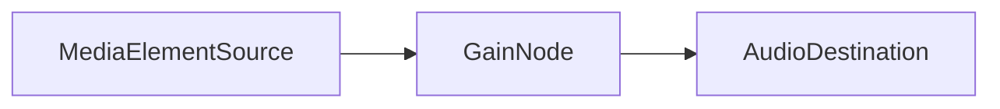

# 技術設計書 (Technical Design Document)

## 1. プロジェクト構成 (Project Structure)
WXTフレームワークに基づくディレクトリ構成を採用する。
```
root/
  ├── entrypoints/
  │   ├── background.ts      # Background Service Worker
  │   ├── content.ts         # Content Script (Main logic)
  │   └── popup/             # Popup Entrypoint
  │       ├── index.html
  │       ├── main.ts
  │       └── App.svelte     # Root Component
  ├── components/            # Svelte Components
  │   ├── AudioController.svelte
  │   ├── DeviceSelector.svelte
  │   └── VolumeSlider.svelte
  ├── utils/                 # Shared Utilities
  │   ├── messaging.ts       # Type-safe Message Passing
  │   └── storage.ts         # Storage Wrapper
  └── wxt.config.ts          # WXT Configuration
```

## 2. モジュール詳細設計
### 2.1 Background Service Worker (`entrypoints/background.ts`)
*   **役割**:
    *   **メッセージ中継**: Popup から Content Script へのメッセージをルーティングする。
    *   **設定管理**: `chrome.storage.local` の読み書きを行う（Content Scriptでも可能だが、Background集約を推奨）。
    *   **タブ監視**: `chrome.tabs.onUpdated` を監視し、ページ遷移時に保存された設定を Content Script にプッシュする。

### 2.2 Content Script (`entrypoints/content.ts`)
*   **役割**: DOM操作とAudio API制御。
*   **主要クラス/関数**:
    *   `AudioManager`: シングルトンクラス。ページ内の全てのメディア要素を管理する。
    *   `observeMediaElements()`: `MutationObserver` をセットアップし、新規追加要素を `AudioManager` に登録する。
    *   `applyAudioSettings(element)`: 指定されたデバイスIDと音量を要素に適用する。
*   **実装詳細**:
    *   `HTMLMediaElement.setSinkId(deviceId)` は Promise を返すため、非同期エラーハンドリングが必要。
    *   `HTMLMediaElement.volume` は同期的に設定可能。

### 2.3 メッセージングプロトコル (`utils/messaging.ts`)
`wxt/browser` のメッセージング機能、または `chrome.runtime.sendMessage` をラップして型安全性を担保する。

```typescript
// メッセージ定義
export type ExtensionMessage =
  | { type: 'GET_TAB_INFO'; payload: { tabId: number } }
  | { type: 'GET_DEVICES'; }
  | { type: 'SET_DEVICE'; payload: { tabId: number; deviceId: string } }
  | { type: 'SET_VOLUME'; payload: { tabId: number; volume: number } }
  | { type: 'RequestPermission'; }; // マイク権限リクエスト用
```

## 3. Web Audio API 実装詳細 (v2.0以降の考慮含む)
v1.0では標準プロパティ（`.volume`）を優先するが、将来的なEQ/増幅対応のための設計も考慮する。

### 3.1 オーディオグラフ構成 (Concept)

*   **v1.0実装**:
    *   Web Audio API (`AudioContext`) は使用せず、直接 `HTMLMediaElement` のプロパティを操作する。
    *   `element.volume = volumeValue;` (0.0 - 1.0)
    *   `element.setSinkId(deviceId);`

## 4. ストレージスキーマ (`chrome.storage.local`)
基本設計書で定義したスキーマに従う。

```typescript
interface StorageSchema {
  // キー: `audio_settings_${origin}` (例: audio_settings_https://youtube.com)
  [key: string]: {
    deviceId: string | null; // デバイスID
    volume: number;          // 0.0 - 1.0
    muted: boolean;
    timestamp: number;
  }
}
```

## 5. セキュリティ設定 (`wxt.config.ts`)
*   **Manifest V3 Configuration**:
    ```typescript
    export default defineConfig({
      manifest: {
        permissions: [
          "activeTab",
          "scripting",
          "storage",
          "tabs"
        ],
        host_permissions: [
          "<all_urls>" // 任意のページで動作させるため
        ],
        web_accessible_resources: [
          // 必要に応じて設定
        ]
      }
    });
    ```

